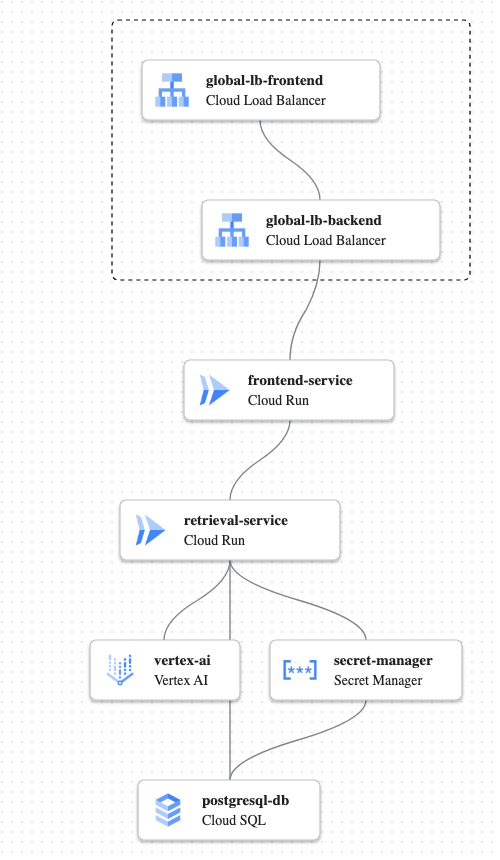
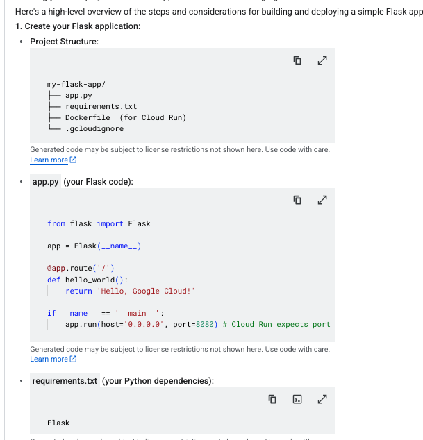
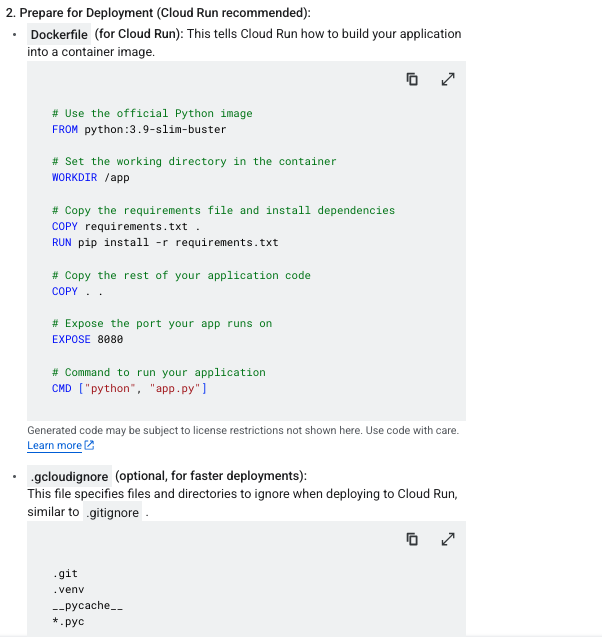
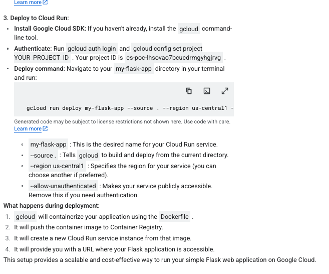
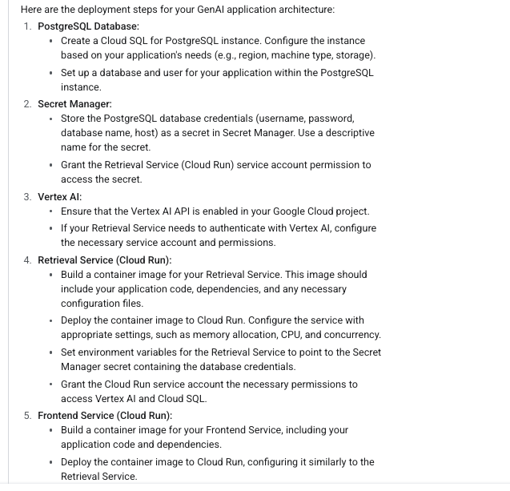
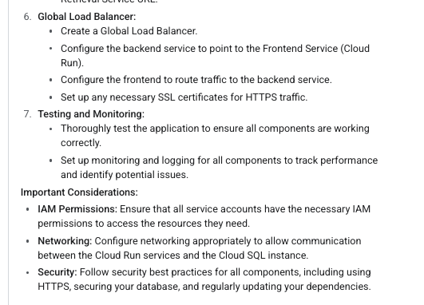
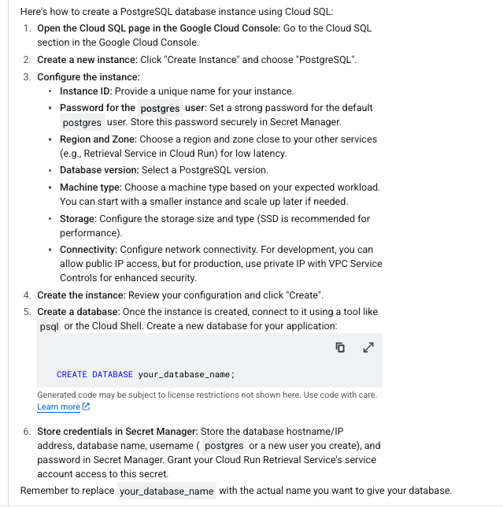

# App-Build-GenAI
Bild a webapp using GenAI
Here is a design for a GenAI application:

A Global Load Balancer (frontend and backend) to handle user traffic.
A Frontend Service (Cloud Run) for the user interface.
A Retrieval Service (Cloud Run) for the core AI logic.
A PostgreSQL Database for the private knowledge base.
Vertex AI for the large language models.
Secret Manager for storing database credentials.

#####

#####
Here are the high-level implementation steps for your GenAI application design:

1. Set up the infrastructure:
    -   Create a PostgreSQL instance using Cloud SQL for PostgreSQL.
    -   Configure Secret Manager to store the database credentials.
    -   Create two Cloud Run services: one for the frontend and one for the      retrieval service.
    -   Configure Vertex AI access.
   -   Create a Global Load Balancer.
2.  Configure the connections:
    -   Configure the Global Load Balancer to route traffic to the frontend Cloud Run service.
    -   Configure the frontend Cloud Run service to communicate with the retrieval Cloud Run service.
    -   Configure the retrieval Cloud Run service to communicate with Vertex AI and PostgreSQL.
    -   Configure the retrieval Cloud Run service to access the database credentials from Secret Manager.
3.  Deploy the application code:
    -   Write and deploy the code for the frontend service.
    -   Write and deploy the code for the retrieval service, including the logic for interacting with Vertex AI and PostgreSQL.
4.  Test and monitor the application:
    -   Test the application thoroughly to ensure it is working as expected.
    -   Set up monitoring to track the application's performance and identify any issues.
####
### Create a sample web app using python and flask ####
To create a simple Python and Flask framework web application on Google Cloud, you would typically use Cloud Run or App Engine . Cloud Run is often preferred for its flexibility and serverless nature, allowing you to deploy containerized applications without managing servers.

Here's a high-level overview of the steps and considerations for building and deploying a simple Flask app:

1. Create your Flask application:
2. Project Structure:
   1. my-flask-app/
├── app.py
├── requirements.txt
├── Dockerfile  (for Cloud Run)
└── .gcloudignore

app.py

from flask import Flask

app = Flask(__name__)

@app.route('/')
def hello_world():
    return 'Hello, Google Cloud!'

if __name__ == '__main__':
    app.run(host='0.0.0.0', port=8080) # Cloud Run expects port 8080

####

requirements.txt (your Python dependencies):

Flask

#######
Prepare for Deployment (Cloud Run recommended):

Dockerfile (for Cloud Run): This tells Cloud Run how to build your application into a container image.
# Use the official Python image
FROM python:3.9-slim-buster

# Set the working directory in the container
WORKDIR /app

# Copy the requirements file and install dependencies
COPY requirements.txt .
RUN pip install -r requirements.txt

# Copy the rest of your application code
COPY . .

# Expose the port your app runs on
EXPOSE 8080

# Command to run your application
CMD ["python", "app.py"]
####
.gcloudignore (optional, for faster deployments):
This file specifies files and directories to ignore when deploying to Cloud Run, similar to .gitignore 

#####

.git
.venv
__pycache__
*.pyc
######

Deploy to Cloud Run:

Install Google Cloud SDK: If you haven't already, install the gcloud command-line tool.
Authenticate: Run gcloud auth login and gcloud config set project YOUR_PROJECT_ID . Your project ID is cs-poc-lhsovao7bcucdrmgyhgjrvg .
Deploy command: Navigate to your my-flask-app directory in your terminal and run:

####
gcloud run deploy my-flask-app --source . --region us-central1 --allow-unauthenticated

my-flask-app : This is the desired name for your Cloud Run service.
--source . : Tells gcloud to build and deploy from the current directory.
--region us-central1 : Specifies the region for your service (you can choose another if preferred).
--allow-unauthenticated : Makes your service publicly accessible. Remove this if you need authentication.
#####

What happens during deployment:

gcloud will containerize your application using the Dockerfile .
It will push the container image to Container Registry.
It will create a new Cloud Run service instance from that image.
It will provide you with a URL where your Flask application is accessible.
This setup provides a scalable and cost-effective way to run your simple Flask web application on Google Cloud.

#####

### Create a deployment steps for this architecture ####

### Create a posstgresql database ###

#####