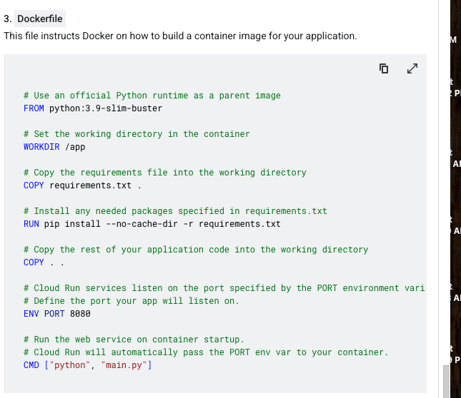

gcloud run deploy frontend \
    --image gcr.io/cs-poc-lhsovao7bcucdrmgyhgjrvg/frontend-service-image \
    --platform managed \
    --region us-west1 \
    --allow-unauthenticated \
    --set-env-vars RETRIEVAL_SERVICE_URL="https://YOUR_RETRIEVAL_SERVICE_URL.run.app"

